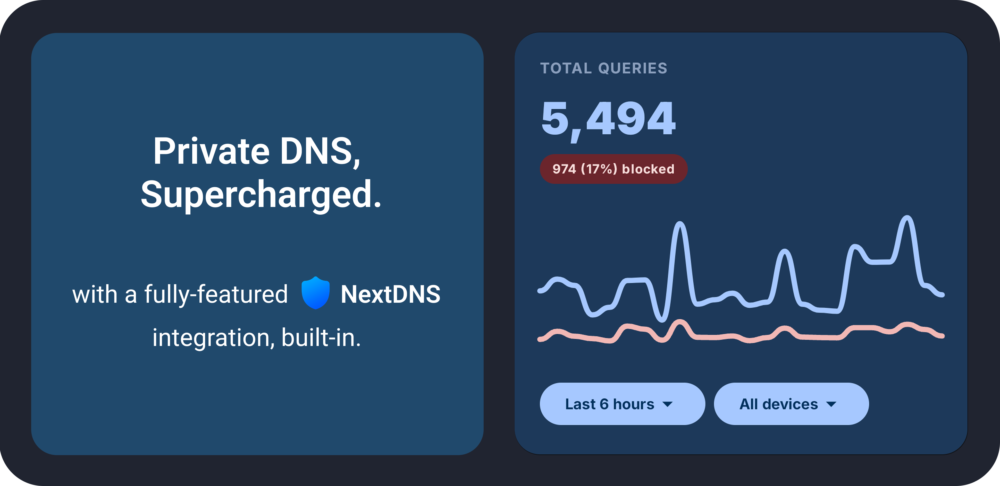
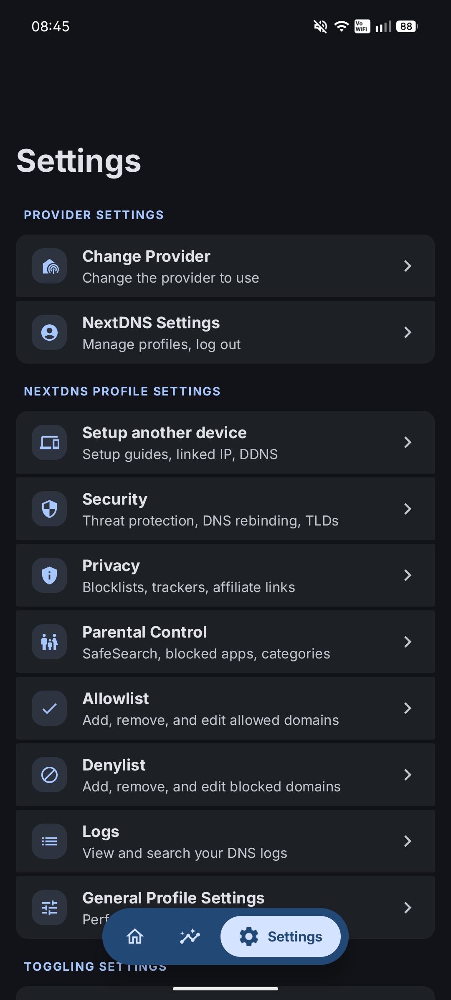
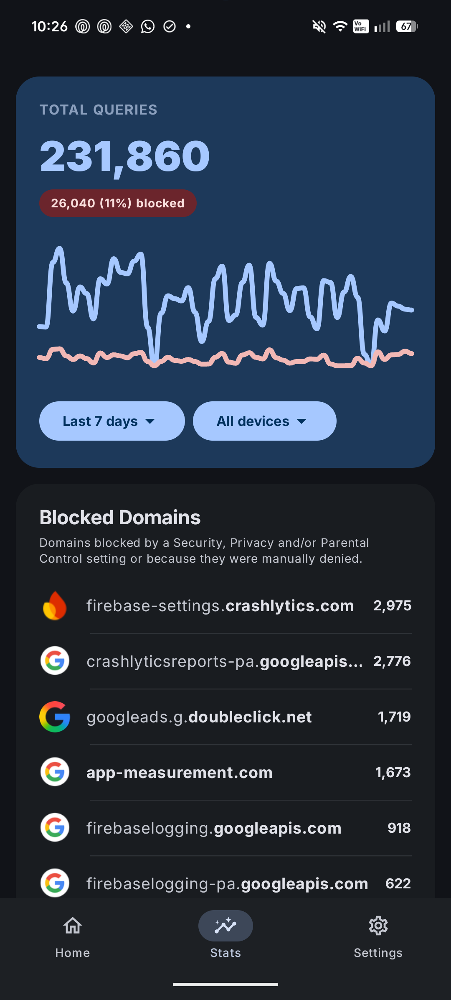
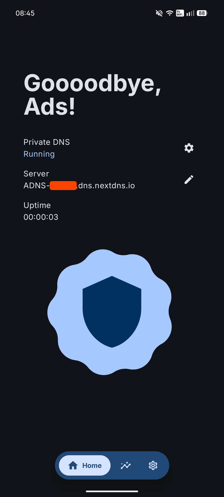

## Overview

ADNS combines a feature-rich Private DNS client for Android with a native NextDNS integration, giving you full control over your device's DNS settings and your NextDNS account.

Currently in Beta. Download it from [GitHub Releases](https://github.com/eyalm2000/adns/releases) or [IzzyOnDroid](https://apt.izzysoft.de/fdroid/index/apk/com.eyalm.adns).

## Three Ways To Use ADNS

### 1. Private DNS Client

Use ADNS as a fast Private DNS controller when you want direct control over system DNS without using a VPN. Requires a one-time Shizuku or ADB setup.

- Turn Private DNS on or off with a single tap
- Apply automatic Wi-Fi rules for specific networks
- State notifications so you can quickly see whether DNS is active
- Quick Settings tile for instant toggle access
- Choose your preferred provider and filtering options when supported (ads, trackers, malware, adult content, and safe search)
- Supported providers include AdGuard, Cloudflare, Google, Quad9, OpenDNS, NextDNS, and custom hostnames

### 2. Native NextDNS Client & Manager

Use ADNS as a full NextDNS app when you want to manage your account without opening a web dashboard. Requires a NextDNS account (no Shizuku or ADB needed).

- View and edit every NextDNS profile setting right from the app
- Inspect NextDNS logs and detailed statistics
- View setup guides for all devices and platforms
- 100% native Android experience - no WebViews involved

### 3. NextDNS + Private DNS Integration

Use ADNS to link your NextDNS account directly to your device's DNS settings and keep both sides in sync. Requires a one-time Shizuku or ADB setup.

- Seamless integration with all ADNS features (Wi-Fi rules, notifications, and Quick Settings tile)
- Automatic NextDNS setup handled entirely for you
- Custom device name support (appears in your NextDNS dashboard, statistics, and logs)
- One-click NextDNS profile switching that updates the system DNS settings for you

## Roadmap

The implementation roadmap lives here: [GitHub Projects](https://github.com/users/eyalm2000/projects/5).  
See the latest project updates on [GitHub Discussions](https://github.com/eyalm2000/adns/discussions/20).

## Build From Source

Build using the Gradle wrapper from the project root:

- Windows: `gradlew.bat assembleDebug`
- macOS/Linux: `./gradlew assembleDebug`

## Disclaimer

ADNS is an independent project and is not affiliated with NextDNS in any way.

## License

This project is licensed under the MIT License. See [LICENSE](LICENSE) for the full text.

  

    
    
    

